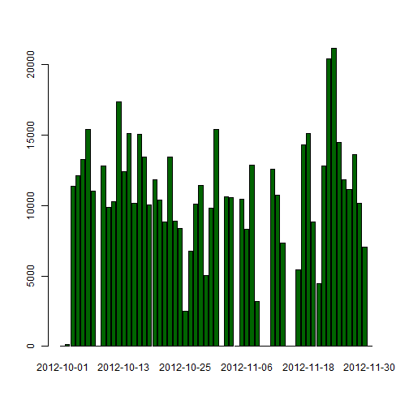

# Reproducible Research: Peer Assessment 1


## Loading and preprocessing the data

Load data from zip-file.

```r
data <- read.csv(unz("activity.zip", "activity.csv"), header = T, sep = ",")
```


Creating new column - date_POSIXlt for dates in POSIXlt format

```r
data$date_POSIXlt = strptime(data$date, format = "%Y-%m-%d", tz = "GMT")
```


## What is mean total number of steps taken per day?


```r
diff_dates = unique(data$date)
steps_by_day = rep.int(0, length(diff_dates))
iter = 1:length(diff_dates)

for (i in iter) steps_by_day[i] = sum(data[data$date == diff_dates[i], "steps"], 
    na.rm = TRUE)

barplot(steps_by_day, names.arg = diff_dates, col = "darkgreen")
```

 

Mean total number of steps taken per day is 9354.2295. 
Median is 10395.

## What is the average daily activity pattern?


## Imputing missing values


## Are there differences in activity patterns between weekdays and weekends?
