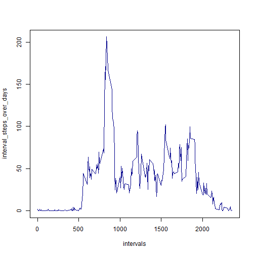

# Reproducible Research: Peer Assessment 1

## Loading and preprocessing the data

Load data from zip-file.


```r
data <- read.csv(unz("activity.zip", "activity.csv"), header = T, sep = ",")
```


Creating new column - date_POSIXlt for dates in POSIXlt format. We use "GMT" timezone
through it is irrelevant for current analysis.


```r
data$date_POSIXlt = strptime(data$date, format = "%Y-%m-%d", tz = "GMT")
```


## What is mean total number of steps taken per day?
Creating boxplot (histogram).


```r
diff_dates = unique(data$date)
steps_by_day = rep.int(0, length(diff_dates))
iter = 1:length(diff_dates)

for (i in iter) steps_by_day[i] = sum(data[data$date == diff_dates[i], "steps"], 
    na.rm = TRUE)

barplot(steps_by_day, names.arg = diff_dates, col = "darkgreen")
```

 


Calculating mean.


```r
mean(steps_by_day)
```

```
## [1] 9354
```


Calculating median.


```r
median(steps_by_day)
```

```
## [1] 10395
```


## What is the average daily activity pattern?
Creating time series plot.

```r
intervals = unique(data$interval)
interval_steps_over_days = rep(0, length(intervals))
interval_iter = 1:length(intervals)
for (i in interval_iter) interval_steps_over_days[i] = mean(data[data$interval == 
    intervals[i], "steps"], na.rm = TRUE)
plot(intervals, interval_steps_over_days, type = "l", col = "darkblue")
```

 


Find 5-minute interval with maximum number of steps on average across all the days in the dataset.

```r
max_interval_index = which(interval_steps_over_days == max(interval_steps_over_days))
print(intervals[max_interval_index])
```

```
## [1] 835
```

## Imputing missing values


## Are there differences in activity patterns between weekdays and weekends?
