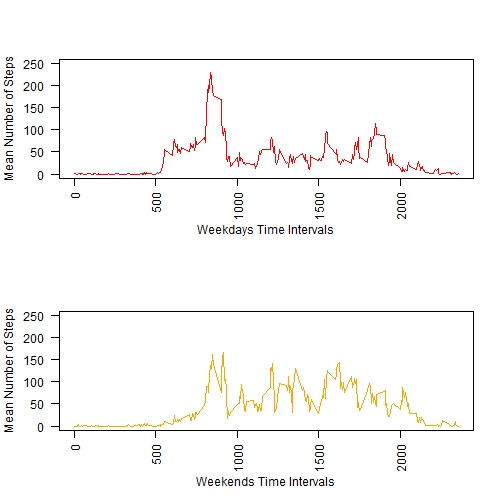

# Reproducible Research: Peer Assessment 1

## Loading and preprocessing the data

Load data from zip-file.


```r
data <- read.csv(unz("activity.zip", "activity.csv"), header = T, sep = ",")
```


## What is mean total number of steps taken per day?

Creating boxplot (histogram) of total steps per day.


```r
StepsPerDayPlot <- function(par_data, plot_color) {
    diff_dates = unique(par_data$date)
    steps_by_day = rep.int(0, length(diff_dates))
    iter = 1:length(diff_dates)
    for (i in iter) steps_by_day[i] = sum(par_data[par_data$date == diff_dates[i], 
        "steps"], na.rm = TRUE)
    barplot(steps_by_day, names.arg = diff_dates, col = plot_color)
    return(steps_by_day)
}
steps_by_day = StepsPerDayPlot(data, "darkgreen")
```

 


Calculating mean.


```r
mean(steps_by_day)
```

```
## [1] 9354
```


Calculating median.


```r
median(steps_by_day)
```

```
## [1] 10395
```


## What is the average daily activity pattern?

Creating time series plot.


```r
MeanStepsPerIntervalPlot <- function(arg_data, plot_color, xlab, ylab) {
    intervals = unique(arg_data$interval)
    interval_steps_over_days = rep(0, length(intervals))
    interval_iter = 1:length(intervals)
    for (i in interval_iter) interval_steps_over_days[i] = mean(arg_data[arg_data$interval == 
        intervals[i], "steps"], na.rm = TRUE)
    plot(intervals, interval_steps_over_days, type = "l", col = plot_color, 
        xlab = xlab, ylab = ylab, las = 2, ylim = c(0, 250))
    return(interval_steps_over_days)
}
interval_steps_over_days = MeanStepsPerIntervalPlot(data, "darkblue", "Time Intervals", 
    "Mean Number of Steps")
```

 


Find 5-minute interval with maximum number of steps on average across all the days in the dataset.


```r
max_interval_index = which(interval_steps_over_days == max(interval_steps_over_days))
intervals = unique(data$interval)
print(intervals[max_interval_index])
```

```
## [1] 835
```


## Imputing missing values

Get total number of NA values in dataset.


```r
print(sum(is.na(data)))
```

```
## [1] 2304
```


The only column where the NA values are is "steps".


```r
print(sum(is.na(data$steps)))
```

```
## [1] 2304
```


Changing NA cells to average number of steps at corresponding **day** is not wise - 
number of steps have much variability depending on time interval. So it is more appropriate
to take mean value of steps during corresponding **time interval** across all days. Plus, such
averages are already calculated.

First, dublicate dataset.


```r
data2 = data
```


Now, changing values.


```r
rows_with_NA = which(is.na(data2$steps))
for (i in rows_with_NA) {
    mean_index = which(intervals == data2$interval[i])
    data2$steps[i] = interval_steps_over_days[mean_index]
}
```


Checking absense of NA values.


```r
print(sum(is.na(data2)))
```

```
## [1] 0
```


Creating two boxplots (histograms) of total steps per day with original and 
modified datasets for easier comparison. Blue horizontal line is at the level of mean 
in both cases.


```r
par(mfrow = c(2, 1))
steps_by_day_old = StepsPerDayPlot(data, "darkgreen")
abline(h = mean(steps_by_day_old), col = "blue")
steps_by_day_new = StepsPerDayPlot(data2, "green")
abline(h = mean(steps_by_day_new), col = "blue")
```

 

```r
par(mfrow = c(1, 1))
```


Old mean and median.


```r
mean(steps_by_day_old)
```

```
## [1] 9354
```

```r
median(steps_by_day_old)
```

```
## [1] 10395
```


New mean and median.


```r
mean(steps_by_day_new)
```

```
## [1] 10766
```

```r
median(steps_by_day_new)
```

```
## [1] 10766
```


For new dataset **mean** is higher which should be (we increased number of steps at days where
NA values were). The **median** is also higher (which not nesessarely *should be*, but it is so in this case).

## Are there differences in activity patterns between weekdays and weekends?

Creating new column for modified dataset - date_POSIXlt for dates in POSIXlt format. We use "GMT" timezone
through it is irrelevant for current analysis.


```r
data2$date_POSIXlt = strptime(data2$date, format = "%Y-%m-%d", tz = "GMT")
class(data2$date_POSIXlt)[1]
```

```
## [1] "POSIXlt"
```


Creating new column indicating "weekday" or "weekend".


```r
DayOrEnd <- function(wday) {
    arg_size = length(wday)
    res = rep("", arg_size)
    for (i in 1:arg_size) # Sunday or Saturday
    if (wday[i] == 0 || wday[i] == 6) 
        res[i] = "weekend" else res[i] = "weekday"
    return(res)
}
data2$de = DayOrEnd(data2$date_POSIXlt$wday)
data2$de = as.factor(data2$de)
```


Split dataset in two: one for rows corresponding to weekdays and other for weekends.


```r
data2WD = data2[data2$de == "weekday", ]
data2WE = data2[data2$de == "weekend", ]
```


Creating time series plots.


```r
par(mfrow = c(2, 1))
MeanStepsPerIntervalPlot(data2WD, "red", "Weekdays Time Intervals", "Mean Number of Steps")
MeanStepsPerIntervalPlot(data2WE, "orange", "Weekends Time Intervals", "Mean Number of Steps")
```

 

```r
par(mfrow = c(1, 1))
```


Subject moving more actively through the weekends overall, but wakes up later. :)
